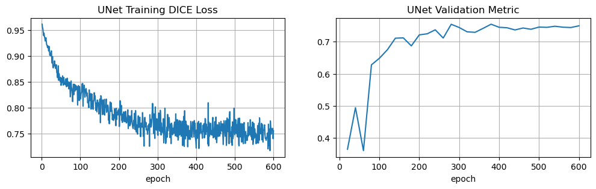
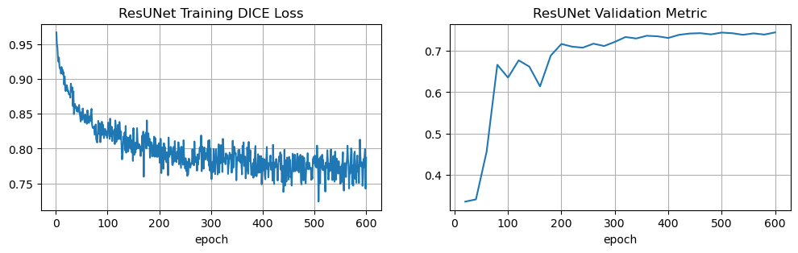
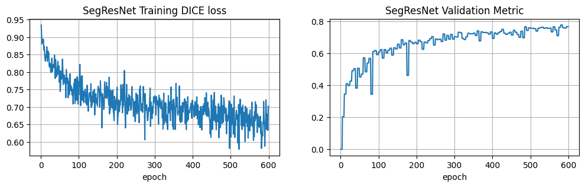
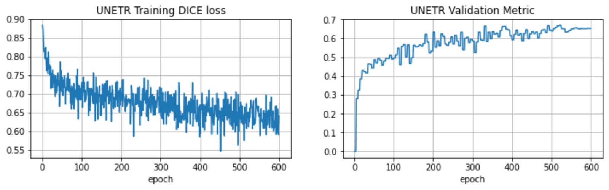
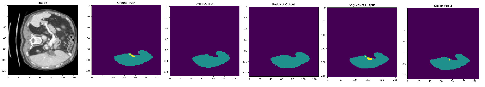

# 3D_Liver_Tumor_segmentation
In this project, we have compared Liver Tumor segmentation accuracies of four different architectures- UNet, ResUNet, SegResNet, & UNETR, over 2017 LiTS dataset. To evaluate the architectures' performances we used DICE score. 

# Dataset
The dataset is available for download on https://drive.google.com/drive/folders/13gtsM4-iFiBd_8cMKvIO7Q73d-YcdB0H?usp=share_link . Place this dataset in the "data" directory with the following structure.

data-> 
----images-> 
----------volume-0.nii 
----------.... 
----------volume-130.nii 
----segmentations-> 
----------segmentation-0.nii 
----------.... 
----------segmentation-130.nii 
# MONAI & dependencies Installation
To install monai: 
pip install monai 

Then install some necessary dependencies: 
git clone https://github.com/Project-MONAI/MONAI.git  
cd MONAI/  
pip install -e '.[nibabel,skimage]'  

# Training & Inference
To train the four architectures, run the "train_two_class.py" where the specific model to train can be passed as an argument. Also, the notebook "UNETR_LiTS_segmentation_3d.ipynb" can be only be used for training UNETR model, however, this notebook can be used to visualize the segmentation results for all the four achitectures.

# Results

